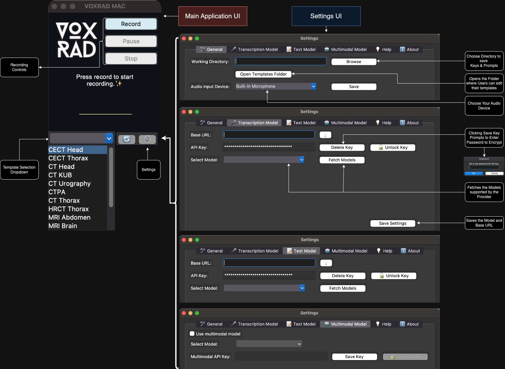

  

  

# 🚀 VOXRAD 

VOXRAD is a voice transcription application for radiologists leveraging voice transcription models and large language models to restructure and format reports as per predefined user instruction templates.

**Welcome to The VOXRAD App! 🌟 🎙**

This application leverages the power of generative AI to efficiently transcribe and format radiology reports from audio inputs. Designed for radiologists and radiology residents, it transforms spoken content into structured, readable reports.

**Etymology:**

-  **VoxRad** /vɒks-ræd/ *noun*

1. A portmanteau derived from **Vox** (Latin for *voice*) and **Rad** (*radiology*), symbolizing the fusion of voice recognition with radiology. Represents the integration of voice recognition technology with radiological imaging and reporting.

2. An AI-driven app transforming radiology reporting through voice transcription, enhancing accuracy in medical documentation.

## ✨ Features 

- 🎤 Voice transcription
- 📝 Report formatting
- 🤖 Integration with large language models
- ⚙️ Customizable templates
- 📈 Potential to extend the application for dictating other structured notes (discharge notes, OT notes or legal paperwork)

## 🛠️ Getting Set Up

### 💻 Installation 

- Download the `.app` file for Mac or the `.exe` file for Windows from the [releases](https://github.com/drankush/voxrad/releases).

### 🔄 Understanding Workflow
VOXRAD uses two ways to transcribe audio to report.

- Use a combination of using a transcription model to first transcribe audio and then format and restructure the transcript using instruction template.
- Use a multimodal model to directly input the audio and instruction template to provide output.

Read more about the supported models [here](https://voxrad.gitbook.io/voxrad/fundamentals/getting-set-up/understanding-workflow#supported-llms).

### 📄 Customizing Templates

- Click ⚙️ Settings button at bottom right corner of the application interface.

  -  In the first Tab  🛠 General click Browse and select your desired working directory. 

  -  Here your encrypted keys, templates, and last recorded audio file will be kept.

- There is a Templates folder that you can open by clicking the button Open Templates Folder in the 🛠 General  tab of settings.

  - Here you can place .txt and .md template instruction files for various reports like HRCT Thorax, CECT Abdomen, etc.

Read more about [Customizing templates](https://voxrad.gitbook.io/voxrad/fundamentals/getting-set-up/customizing-templates).

### 🔐 Managing Keys

- You can encrypt keys of transcription, text and multimodal models with password and even lock and unlock them while the application is in use. The application will ask for this password every time you start the applicaiton if encrypted keys are stored in working directory.
- In the "Base URL" field,  enter the base URL in OpenAI compatible format. Enter API key in the in the "API Key" field.
- You can use any OpenAI-compatible API key and Base URL and even locally deployed models which create OpenAI compatible endpoints.
- Click **Fetch Model** to see the available models and choose one.
- Click **Save Settings** to save your selected model and Base URL (these are not encrypted).
Read more about managing keys, best practices and troubleshooting [here](https://voxrad.gitbook.io/voxrad/fundamentals/getting-set-up/managing-keys).

### 🖥️ Running Models Locally

- There are [various ways](https://voxrad.gitbook.io/voxrad/running-models-locally) to run models locally and create OpenAI compatible endpoints which can then used with this application.
- You can also input OpenAI compatible Base URL and API key of [any remotely hosted service](https://voxrad.gitbook.io/voxrad/running-models-locally#remotely-hosted-models), however this is not recommended for sensitive data. For example: Groq: https://api.groq.com/openai/v1

## 🖱️ Usage 

### 🎙 Main App Window 

  

- Press the **Record 🔴** button and start dictating your report, keep it around max 15 minutes, as the file sent limit is 25 MB (the application will try to reduce the bitrate to accommodate this size for longer audios). You will see a waveform while the audio is recorded.

- Press **Stop ⬜️** to stop recording. Your audio will be processed.

- The final formatted and structured report will be automatically posted on your clipboard. You can then directly paste (Ctrl/Cmd + V) it into your application, word processor, or PACS.

Read detailed documentation of generating a report [here](https://voxrad.gitbook.io/voxrad/user-guide/generating-a-report).

## 📚 Documentation 

Read comprehensive VOXRAD documentation [here](http://voxrad.gitbook.io/voxrad).

## 🌟 Contributing 

VOXRAD is a community-driven project, and we're grateful for the contributions of our team members. Read about the [key contributors](https://voxrad.gitbook.io/voxrad/support-and-contact/contributors). Please read the [contributing guidelines](CONTRIBUTING.md) before getting started.

## 📜 License 

This project is licensed under the GPLv3 License - see the [LICENSE](LICENSE) file for details.

## 🧩 Third-Party Libraries:

This application uses FFmpeg, which is licensed under the GNU General Public License (GPL) version 2 or later. For more details, please refer to the [documentation](https://github.com/drankush/voxrad/docs/FFmpeg.md/) in the repository.

## 🐞 Support 

To report bugs or issues, please follow [this guide](https://github.com/drankush/voxrad/blob/main/contributing.md#reporting-bugs) on how to report bugs.

## 📧 Contact 

For any other questions, support or appreciation, please contact [Dr. Ankush](mailto:voxrad@drankush.com).

## 🚨 Disclaimer 

This is a pure demonstrative application for the capabilities of AI and may not be compliant with local regulations of handling sensitive and private data. This is not intended for any diagnostic and clinical use. Please read the terms of use of the API keys that you will be using.

- The application is not intended to replace professional medical advice, diagnosis, or treatment.
- Users must ensure they comply with all relevant local laws and regulations when using the application, especially concerning data privacy and security.
- Users are advised to locally host voice transcription and text models and use its endpoints for sensitive data.
- The developers are not responsible for any misuse of the application or any data breaches that may occur.
- The application does not encrypt data by default; users must take additional steps to secure their data.
- Always verify the accuracy of the transcriptions and generated reports manually.

